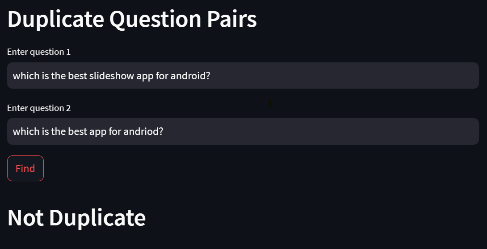

# Quora Question Pairs Web App 🚀

  

Welcome to the Quora Question Pairs Web App! Here, I've unleashed the power of ML to identify question pairs with the same intent. The web app allows users to input two questions and receive predictions on whether the questions have similar meanings or not. No more wasting time on repetitive questions! 🎉

## About the Project and Web App 🌟

My mission is simple: build a smart model that can tell if two questions on Quora mean the same thing. I've harnessed the magic of Natural Language Processing (NLP) and feature engineering to make this happen.

**[Explore the deployed web app here](https://quora-duplicate-question-pair.streamlit.app/)**

    

I started by preprocessing the data to clean and normalize the text data. Then, I performed basic feature engineering, such as calculating the length of questions and computing word overlap. But wait, there's more! I sprinkle in some advanced features using NLP tricks like token analysis and fuzzy comparisons. 🍲

## Enhancing User Experience with NLP 💯

Discover how my NLP model revolutionizes the way users interact with Quora, creating a seamless and engaging experience. Here's how my cutting-edge NLP techniques have transformed the platform:

- Duplicate Content Filtering

- Recommended Questions

- Improved Search Functionality

- Quality Control and Moderation

- Enhanced Question Suggestions

## Diving into the Project 📚

Want to see how I brewed this magic potion? The implementation of the project is documented [here](https://github.com/TanmayMehta-ml/Quora-Question-Pairs/blob/main/explanation.md). In this notebook, each step is explained in detail, making it a valuable resource for understanding the feature engineering and model training process.

## Getting Inspired by Kaggle 💡

My inspiration comes from the legendary Kaggle competition on Quora Question Pairs. While I'm not in the competition, I've adopted similar approaches and learned from the best in the Kaggle community..

For a deep dive into my project and its fascinating implementation, head over to my [Jupyter Notebook](https://github.com/TanmayMehta-ml/Quora-Question-Pairs/blob/main/BOW_with_Advanced_Features.ipynb). And if you're curious about the original Kaggle competition, check it out [here](https://www.kaggle.com/c/quora-question-pairs). 🏆

The project demonstrates the significance of NLP and feature engineering in solving real-world challenges related to question similarity identification. I encourage you to explore the Jupyter Notebook and try out the web app to experience the power of NLP in action!

## References 📖

- Quora Question Pairs Dataset: [Kaggle](https://www.kaggle.com/c/quora-question-pairs)
- Streamlit Documentation: [Streamlit](https://docs.streamlit.io/)
- Scikit-Learn Documentation: [Scikit-Learn](https://scikit-learn.org/stable/)
- FuzzyWuzzy Documentation: [FuzzyWuzzy](https://github.com/seatgeek/fuzzywuzzy)
- NLTK Documentation: [NLTK](https://www.nltk.org/)

Now, grab a coffee ☕ and have fun exploring the magic of question pair identification! 🌈
